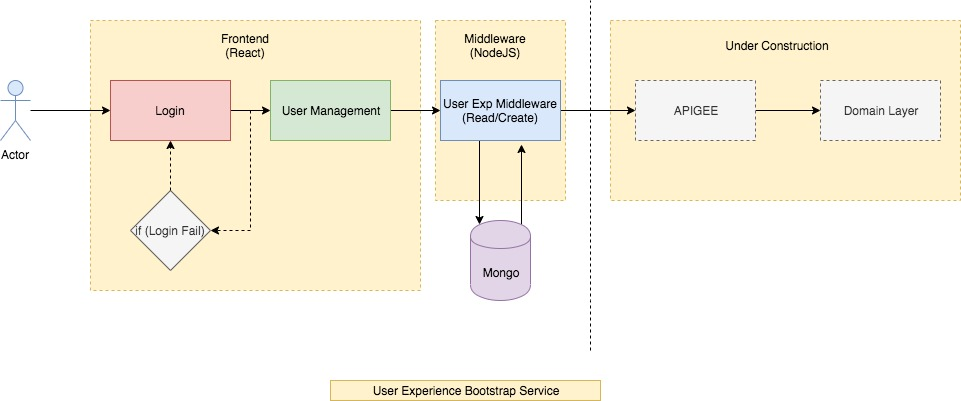

# User Exp Bootstrap Service

## Tools
    1. React@16.12.0
    2. Nodejs@13.2.0
    3. Express@4.17.1
    4. Mongoose@5.7.12
    5. Axios@0.19.0
    6. Lodash@4.17.15

## API to manage users GET and POST
    /users

## Payload for user request
    {
        "name":"sapient",
        "department":"IT",
        "email":"sapient@abc.com",
        "username":"sapient",
        "password":"12345"
    }

## Execute Mongo Docker Container
    docker run -p 27017:27017  mongo
    
## Start Node Middleware
    cd usr-exp-middleware/ && yarn start
    
## Start React App
    cd usr-exp/ && yarn start