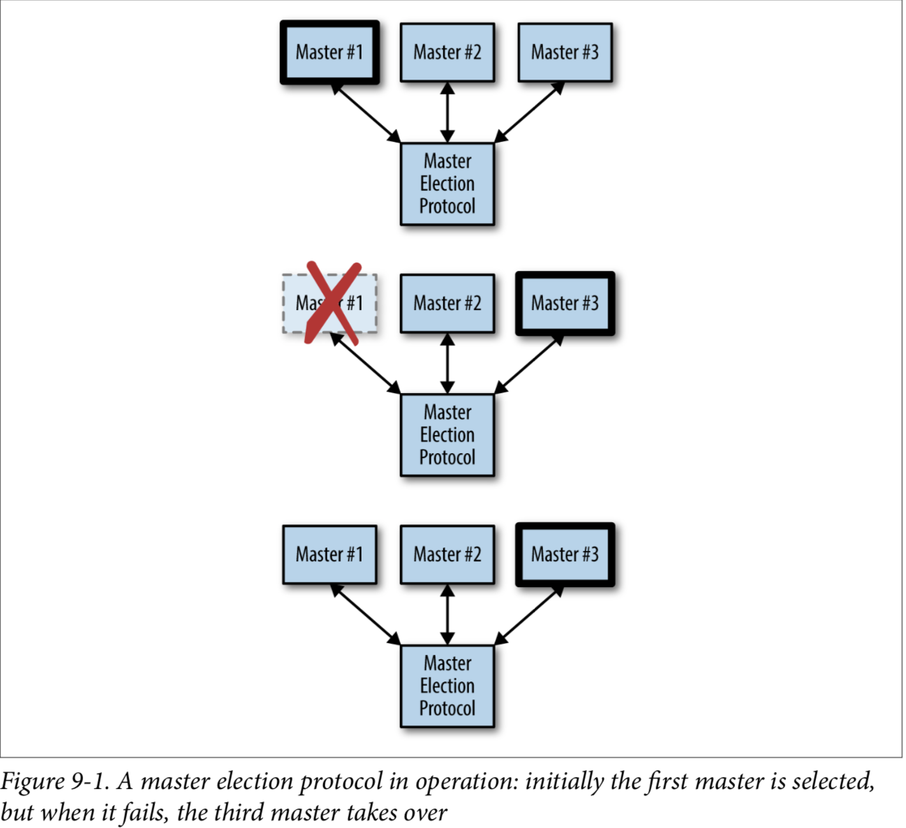

<h1>Designing Distributed Systems<h1>
<h3>Patterns and Paradigms for Scalable, Reliable Services</h3>
<h4>By Brendan Burns</h4><br>
<h2>Single Node Pattern</h2>

<h3>Side Car Pattern</h3>


 
 
 
 An Example Sidecar: Adding HTTPS to a Legacy Service
 
 
 
 Building a Simple PaaS with Sidecars
 
 - Imagine building a simple platform as a service (PaaS) built around the git workflow.  
 - Once you deploy this PaaS, simply pushing new code up to a Git repository results in that code being deployed to the running servers.
 
 
 
 
 
 <h3>Ambassador Pattern</h3>
 
 

Using an Ambassador to Shard a Service
 
 - Sometimes the data that you want to store in a storage layer becomes too big for a single machine to handle. In such situations, you need to shard your storage layer. Sharding splits up the layer into multiple disjoint pieces, each hosted by a separate machine.
 - When adapting an existing application to a sharded backend, you can introduce an ambassador container that contains all of the logic needed to route requests to the appropriate storage shard

Implementing a Sharded Redis

 - Redis is a fast key-value store that can be used as a cache or for more persistent storage.
 - Begin by deploying a sharded Redis service to a Kubernetes cluster.
 - <b>twemproxy</b> is a lightweight, highly performant proxy for memcached and Redis, which was originally developed by Twitter and is open source and available on GitHub.
 - configure twemproxy to point to the replicas created.
 
 
 Using an Ambassador for Service Brokering
 
 - Building a portable application requires that the application know how to introspect its environment and find the appropriate MySQL service to connect to. 
 - This process is called service discovery, and the system that performs this discovery and linking is commonly called a service broker.
 
 
 
 
 Using an Ambassador to Do Request Splitting
 
 - In many production systems, it is advantageous to be able to perform request splitting, where some fraction of all requests are not serviced by the main production service but rather are redirected to a different implementation of the service. 
 - Most often, this is used to perform experiments with new, beta versions of the service to determine if the new version of the software is reliable or comparable in performance to the currently deployed version.
 - To implement our request-splitting experiment, we’re going to use the nginx web server.
 
 ```yaml
        worker_processes  5;
        error_log  error.log;
        pid        nginx.pid;
        worker_rlimit_nofile 8192;
        events {
          worker_connections  1024;
        }
        http {
            upstream backend {
                ip_hash;
                server web weight=9;
                server experiment;
            }
            server {
                listen localhost:80;
                location / {
                    proxy_pass http://backend;
                }
              } 
            }
 ```
 - Using IP hashing in this configuration. This is important because it ensures that the user doesn’t flip-flop back and forth between the experiment and the main site. 
 - This assures that every user has a consistent experience with the application.
 - The weight parameter is used to send 90% of the traffic to the main existing application, while 10% of the traffic is redirected to the experiment.
 
 - As with other examples, we’ll deploy this configuration as a ConfigMap object in Kubernetes:
 
 ```
 kubectl create configmaps --from-file=nginx.conf
 ``` 
 
 
 <h3>Adapter Pattern</h3>
 
 - In the adapter pattern, the adapter container is used to modify the interface of the application container so that it conforms to some predefined interface that is expected of all applications. For exam‐ ple, an adapter might ensure that an application implements a consistent monitoring interface. Or it might ensure that log files are always written to stdout or any number of other conventions.
 
 
 
 
 
 Monitoring
 
 - Applying the adapter pattern to monitoring, we see that the application container is simply the application that we want to monitor. The adapter container contains the tools for transforming the monitoring interface exposed by the application container into the interface expected by the general purpose monitoring system.
 
 
 Using Prometheus for Monitoring
 
 - Prometheus is a monitoring aggregator, which collects metrics and aggregates them into a single time-series database. 
 - On top of this database, Prometheus provides visualization and query language for introspecting the collected metrics. 
 - To collect metrics from a variety of different systems, Prometheus expects every container to expose a specific metrics API. 
 - This enables Prometheus to monitor a wide variety of different programs through a single interface.
 
 - Redis key-value store, do not export metrics in a format that is compatible with Prometheus.
 - The adapter pattern is quite useful for taking an existing service like Redis and adapting it to the Prometheus metrics-collection interface.
 - Provide an adapter that implements the Prometheus interface. The following image is an adapter for Redis metrics to Prometheus conversion.
        
  ```
  - image: oliver006/redis_exporter
  ```       
  
  
  Logging
  
  - In the world of containerized applications where there is a general expectation that your containers will log to stdout, because that is what is available via commands like docker logs or kubectl logs.
  - Different application containers can log information in different formats, but the adapter container can transform that data into a single structured representation that can be consumed by your log aggregator.
  
  Normalizing Different Logging Formats with Fluentd
  
  - fluentd is one of the more popular open source logging agents available. One of its major features is a rich set of community-supported plugins that enable a great deal of flexibility in monitoring a variety of applications.
  - Redis is a popular key-value store; one of the commands it offers is the SLOWLOG command. This command lists recent queries that exceeded a particular time interval. Such information is quite useful in debugging your application’s performance. 
  - Unfortunately, SLOWLOG is only available as a command on the Redis server, which means that it is difficult to use retrospectively if a problem happens when someone isn’t available to debug the server.
  - To fix this limitation, we can use fluentd and the adapter pattern to add slow-query logging to Redis.
  - Use the adapter pattern with a redis container as the main application container, and the fluentd container as our adapter container. 
  - In this case, we will also use the fluent-plugin-redis-slowlog fluentd plugin to listen to the slow queries. 
  - We can configure this plugin using the following snippet:

   ```
   <source>
         type redis_slowlog
         host localhost
         port 6379
         tag redis.slowlog
   </source>
   ```
   
   - A similar exercise can be done to monitor logs from the Apache Storm system.
   - we deploy a fluentd adapter with the fluent-plugin-storm plugin enabled.
   
   ```
   <source>
         type storm
         tag storm
         url http://localhost:8080
         window 600
         sys 0
   </source>
   ```
   
   <hr>
   <h2>Serving Patterns</h2>
   
   <h3>Replicated Load-Balanced Services</h3>

   Stateless Services
   
   
   
   - Stateless services include things like static content servers and complex middleware systems that receive and aggregate responses from numerous different backend systems. 
   - No matter how small your service is, you need at least two replicas to provide a service with a “highly available” service level agreement (SLA).
   - Consider trying to deliver a three-nines (99.9% availability). In a three-nines service, you get 1.4 minutes of downtime per day (24 × 60 × 0.001).
   - Assuming that you have a service that never crashes, that still means you need to be able to do a software upgrade in less than 1.4 minutes in order to hit your SLA with a single instance.
   - If your team is really embracing contin‐ uous delivery and you’re pushing a new version of software every hour, you need to be able to do a software rollout in 3.6 seconds to achieve your 99.9% uptime SLA with a single instance.
   - Any longer than that and you will have more than 0.01% downtime from those 3.6 seconds.
   - That way, while you are doing a rollout, or in the—unlikely, I’m sure—event that your software crashes, your users will be served by the other replica of the service and never know anything was going on. 
   - Horizontally scalable systems handle more and more users by adding more replicas;
   
   
   
   Readiness Probes for Load Balancing
   
   - A readiness probe determines when an application is ready to serve user requests.
   - When building an application for a replicated service pattern, be sure to include a special URL that implements this readiness check.
   
   ```yaml
        spec:
          containers:
          - name: server
            image: brendanburns/dictionary-server
            ports:
            - containerPort: 8080
            readinessProbe:
              httpGet:
                path: /ready
                port: 8080
              initialDelaySeconds: 5
              periodSeconds: 5
   ```
   
   Session Tracked Services
   
   - Often there are reasons for wanting to ensure that a particular user’s requests always end up on the same machine. Sometimes this is because you are caching that user’s data in memory, so landing on the same machine ensures a higher cache hit rate.
   - This session tracking is performed by hashing the source and destination IP addresses and using that key to identify the server that should service the requests. So long as the source and destination IP addresses remain constant, all requests are sent to the same replica.
   - IP-based session tracking works within a cluster (internal IPs) but generally doesn’t work well with external IP addresses because of network address translation (NAT). For external session tracking, application-level tracking (e.g., via cookies) is preferred.
   - Session tracking is accomplished via a consistent hashing function. When the number of replicas changes, the mapping of a particular user to a replica may change.
   - Consistent hashing functions minimize the number of users that actually change which replica they are mapped to, reducing the impact of scaling on your application.
   
   Introducing a Caching Layer
   
   - The simplest form of caching for web applications is a caching web proxy. The caching proxy is simply an HTTP server that maintains user requests in memory state. If two users request the same web page, only one request will go to your backend; the other will be serviced out of memory in the cache.
   
   
   
   ```yaml
          spec:
             containers:
             - name: cache
               image: brendanburns/varnish
               command:
               - varnishd
               - -F
               - -f
               - /etc/varnish-config/default.vcl
               - -a
               - 0.0.0.0:8080
               - -s
               # This memory allocation should match the memory request above 
               - malloc,2G
               resources:
                 requests:
                   # We'll use two gigabytes for each varnish cache
                   memory: 2Gi
   ```
   
   
   Expanding the Caching Layer
   
   Rate Limiting and Denial-of-Service Defense
   
   - Accidentally running a load test against a production installation. Thus, it makes sense to add general denial-of-service defense via rate limiting.
   - A best practice to have a relatively small rate limit for anonymous access and then force users to log in to obtain a higher rate limit. 
   - Requiring a login provides auditing to determine who is responsible for the unexpected load.
   - Also offers a barrier to would-be attackers who need to obtain multiple identities to launch a successful attack.
   - When a user hits the rate limit, the server will return the 429 error code indicating that too many requests have been issued.
   
   SSL Termination

   - Each individual internal service should use its own certificate to ensure that each layer can be rolled out independently. 
   - Thus we want to add a third layer to our stateless application pattern, which will be a replicated layer of nginx servers that will handle SSL termination for HTTPS traffic and forward traffic on to our cache.
   
   
   
   - nginx con‐ figuration to serve SSL:
   
   ```
       events {
             worker_connections  1024;
       }
       http {
         server {
           listen 443 ssl;
           server_name my-domain.com www.my-domain.com;
           ssl on;
           ssl_certificate         /etc/certs/tls.crt;
           ssl_certificate_key     /etc/certs/tls.key;
           location / {
               proxy_pass http://varnish-service:80;
               proxy_set_header Host $host;
               proxy_set_header X-Forwarded-For $proxy_add_x_forwarded_for;
               proxy_set_header X-Forwarded-Proto $scheme;
               proxy_set_header X-Real-IP $remote_addr;        
           } 
         }
       }
   ```

   
   <h3>Sharded Services</h3>
   
   
   
   
   - Replicated services are generally used for building stateless services, whereas sharded services are generally used for building stateful services.
   - The primary reason for sharding the data is because the size of the state is too large to be served by a single machine.
   
   Sharded Caching
   
   - A sharded cache is a cache that sits between the user requests and the actually frontend implementation.
   
   
   
   
   Why You Might Need a Sharded Cache ?
   
   - To understand how this helps a caching system, imagine the following system:
     - Each cache has 10 GB of RAM available to store results, and can serve 100 requests per second (RPS).
     - Suppose then that our service has a total of 200 GB possible results that could be returned, and an expected 1,000 RPS.
     - We need 10 replicas of the cache in order to satisfy 1,000 RPS (10 replicas × 100 requests per second per replica).
     - But deployed this way, the distributed cache can only hold a maximum of 5% (10 GB/200 GB) of the total data set that we are serving. This is because each cache replica is independent, and thus each cache replica stores roughly the exact same data in the cache. This is great for redundancy, but pretty terrible for maximizing memory utilization.
     - If instead, we deploy a 10-way sharded cache, we can still serve the appropriate number of RPS (10 × 100 is still 1,000), but because each cache serves a completely unique set of data, we are able to store 50% (10 × 10 GB/200 GB) of the total data set. This tenfold increase in cache storage means that the memory for the cache is much better utilized, since each key exists only in a single cache.
     
   The Role of the Cache in System Performance
   
   - If the cache were to fail, what would the impact be for your users and your service?
   - In case of the replicated cache, the cache itself was horizontally scalable, and failures of specific replicas would only lead to transient failures. Likewise, the cache could be horizontally scaled in response to increased load without impacting the end user.  
   - When you consider sharded caches. Because a specific user or request is always mapped to the same shard, if that shard fails, that user or request will always miss the cache until the shard is restored.
   - The performance of your cache is defined in terms of its hit rate. The hit rate is the percentage of the time that your cache contains the data for a user request.
   
   Replicated, Sharded Caches
   
   - A sharded, replicated service combines the replicated service pattern described in the previous chapter with the sharded pattern described in previous sections.
   - Rather than having a single server implement each shard in the cache, a replicated service is used to implement each cache shard.
   - By replacing a single server with a replicated service, each cache shard is resilient to failures and is always present during failures.
   - Because each replicated cache shard is an independent replicated service, you can scale each cache shard in response to its load; this sort of “hot sharding”.
   - An alternative is to deploy a replicated shard router service. The downside of a shared service is twofold.
     - because it is a shared service, you will have to scale it larger as demand load increases.
     - using the shared service introduces an extra network hop that will add some latency to requests and contribute network bandwidth to the overall distributed system.
     
   ```
       memcache:
         listen: 0.0.0.0:11211 # To deploy a shared routing service, change the twemproxy configuration so that it listens on all interfaces, not just localhost:
         hash: fnv1a_64
         distribution: ketama
         auto_eject_hosts: true
         timeout: 400
         server_retry_timeout: 2000
         server_failure_limit: 1
         servers:
          - memcache-0.memcache:11211:1
          - memcache-1.memcache:11211:1
          - memcache-2.memcache:11211:1
   ```  
   
   
   Sharding Functions
   
   - Shard = ShardingFunction(Req)
   - The sharding function is defined using a hashing function and the modulo (%) operator.
   - Hashing functions are functions that transform an arbitrary object into an integer hash. The hash function has two important characteristics for our sharding:
     - Determinism:  it ensures that a particular request R always goes to the same shard in the service.  
     - Uniformity: it ensures that load is evenly spread between the different shards.
     
   
   Consistent Hashing Functions
   
   - scaling the cache from 10 to 11 replicas is straightforward to do with a container orchestrator, but consider the effect of changing the scaling function from hash(Req) % 10 to hash(Req) % 11.
   - In a sharded cache, this is going to dramatically increase your miss rate until the cache is repopulated with responses for the new requests that have been mapped to that cache shard by the new sharding function. In the worst case, rolling out a new sharding function for your sharded cache will be equivalent to a complete cache failure. 
   - Consistent hashing functions are special hash functions that are guaranteed to only remap # keys / # shards, when being resized to # shards.
   - if we use a consistent hashing function for our sharded cache, moving from 10 to 11 shards will only result in remapping < 10% (K / 11) keys. This is dramatically better than losing the entire sharded service.
   
   
   Building a Consistent HTTP Sharding Proxy
   
   ```yaml
    worker_processes  5;
        error_log  error.log;
        pid        nginx.pid;
        worker_rlimit_nofile 8192;
        events {
          worker_connections  1024;
    }
        http {
            # define a named 'backend' that we can use in the proxy directive
            # below.
            upstream backend {
                # Has the full URI of the request and use a consistent hash
                hash $request_uri consistent
                server web-shard-1.web;
                server web-shard-2.web;
                server web-shard-3.web;
            }
        server {
                listen localhost:80;
                location / {
                    proxy_pass http://backend;
                }
            } 
    }
   ```
   - A good general-purpose key is the request path as well as the fragment and query parameters (i.e., everything that makes the request unique).
   - This does not include cookies from the user or the language/location (e.g., EN_US). 
   
   
   <h3>Scatter/Gather</h3>
   
   - The scatter/gather pattern allows you to achieve parallelism in servicing requests, enabling you to service them significantly faster than you could if you had to service them sequentially. 
   - The scatter/gather pattern is a tree pattern with a root that distributes requests and leaves that process those requests.  
   - Each replica does a small amount of processing and then returns a fraction of the result to the root.
   - The root server then combines the various partial results together to form a single complete response to the request and then sends this request back out to the client.
   
   - Scatter/gather can be seen as sharding the computation necessary to service the request, rather than sharding the data (although data sharding may be part of it as well).
   
   
   
   - Each leaf is entirely homogenous but the work is distributed to a number of different leaves in order to improve the performance of the request.
   
   Sharded Document Search
   
   - We were looking for all documents that contained “cat” and “dog.”
   - When a user makes a request for all documents that match the words “cat” and “dog,” the request is actually sent out to every leaf in the scatter/gather system. Each leaf node returns the set of documents that it knows about that matches “cat” and “dog.”
   - The first leaf serves documents 1 through 10 and returns {doc1, doc5}. The second leaf serves documents 11 through 20 and returns {doc15}. The third leaf serves documents 21 through 30 and returns {doc22, doc28}. The root combines all of these responses together into a single response and returns {doc1, doc5, doc15, doc22, doc28}.
   
   
 
    
   <h3>Functions and Event-Driven Processing</h3>
   
   - the benefits, limitations, and optimal situations for employing event-driven computing.
     - The Benefits of FaaS
       - Because there is no artifact to create or push beyond the source code itself, FaaS makes it simple to go from code on a laptop or web browser to running code in the cloud.
       - the code that is deployed is managed and scaled automatically
       - Functions are stateless and thus any system you build on top of functions is inherently more modular and decoupled than a similar system built into a single binary.
     - The Challenges of FaaS
       - FaaS forces you to strongly decouple each piece of your service. Each function is entirely independent. The only communication is across the network, and each function instance cannot have local memory, requiring all states to be stored in a storage service. This forced decoupling can improve the agility and speed with which you can develop services, but it can also significantly complicate the operations of the same service. 
       - It is often quite difficult to obtain a comprehensive view of your service, determine how the various functions integrate with one another, and understand when things go wrong, and why they go wrong.
   
   - Functions are executed in response to discrete events that occur and trigger the execution of the functions. Additionally, because of the serverless nature of the implementation of theses serv‐ ices, the runtime of any particular function instance is generally time bounded. This means that FaaS is usually a poor fit for situations that require processing. Examples of such background processing might be transcoding a video, compressing log files, or other sorts of low-priority, long-running computations.
   - To achieve that, you need to launch your code in an environment that supports long-running processes. And this generally means switching to a pay-per-consumption rather than pay-per-request model for the parts of your application that do background processing.
   
       
   <h4>Patterns for FaaS</h4>
   
   The Decorator Pattern: Request or Response Transformation
   
   - FaaS is ideal for deploying simple functions that can take an input, transform it into an output, and then pass it on to a different service. This general pattern can be used to augment or decorate HTTP requests to or from a different service.
   - Because decoration transformations are generally stateless, and also because they are often added after the fact to existing code as the service evolves, they are ideal services to implement via FaaS.
   - Use the kubeless FaaS framework. Kubeless is deployed on top of the Kubernetes container orchestration service. Assuming that you have provisioned a Kubernetes cluster. Kubeless installs itself as a native Kubernetes third-party API. You can see deployed functions using kubectl get functions.
   
   Handling Events
   
   - Examples of events include a user signing up for a new service (which might trigger a welcome email, someone uploading a file to a shared folder (which might send notifications to everyone who has access to the folder), or even a machine being about to reboot (which might notify an operator or automated system to take appropriate action).
   
   - Implementing Two-Factor Authentication
     - Two-factor authentication is significantly more secure than pass‐ words alone since it requires two different security compromises (a thief learning your password and a thief stealing your phone) to enable a true security problem.
     - A better option is to register a FaaS to asynchronously generate the random number, register it with the login service, and send the number to the user’s phone. In this way, the login server can simply fire an asynchronous web-hook request to a FaaS, and that FaaS can handle the somewhat slow and asynchronous task of registering the two-factor code and sending the text message.
   
   
   <h3>Ownership Election</h3>
   
   - There are three replicas that could be the owner or master. Initially, the first replica is the master. Then that replica fails, and replica number three then becomes the master. Finally, replica number one recovers and returns to the group, but replica three remains as the master/owner.
   
          
   
   - There are two ways to implement this master election. 
     - This first is to implement a distributed consensus algorithm like Paxos or RAFT. Implementing one of these algorithms is akin to implementing locks on top of assembly code compare-and-swap instructions.
     - Compare-and-swap atomically writes a new value if the existing value matches the expected value. If the value doesn’t match, it returns false. If the value doesn’t exist and currentValue is not null, it returns an error.
   
   - Fortunately, there are a large number of distributed key-value stores that have implemented such consensus algorithms for you.
   - Examples of these distributed stores include etcd, ZooKeeper, and consul. The basic primitives that these systems provide is the ability to perform a compare-and-swap operation for a particular key.
   
   
   Implementing Locks
   
   - When using distributed locks, it is critical to ensure that any processing you do doesn’t last longer than the TTL of the lock. One good practice is to set a watchdog timer when you acquire the lock. The watchdog contains an assertion that will crash your program if the TTL of the lock expires before you have called unlock.
   
   Implementing Ownership
   
   - For example, in a highly available deployment of Kubernetes, there are multiple replicas of the scheduler but only one replica is actively making scheduling decisions. Further, once it becomes the active scheduler, it remains the active scheduler until that process fails for some reason.
   - one way to do this would be to extend the TTL for the lock to a very long period (say a week or longer), but this has the significant downside that if the current lock owner fails, a new lock owner wouldn’t be chosen until the TTL expired a week later.
   - Instead, we need to create a renewable lock, which can be periodically renewed by the owner so that the lock can be retained for an arbitrary period of time.
   - the lock is renewed every ttl/2 seconds; that way there is significantly less risk that the lock will accidentally expire due to timing subtleties.
   
   Implementing Leases in etcd
   
   - The ttl flag defines a time after which the lock that we create is deleted. Because the lock disappears after the ttl expires, instead of creating with the value of unlocked, we will assume that the absence of the lock means that it is unlocked.
   - Creates a leased lock with a duration of 10 seconds.
   
   <hr>
   <h2>Batch Computational Patterns</h2>
   
   <h3>Work Queue Systems</h3>
   
   )
   
   
   The Source Container Interface
   
   - In the containerized work queue, there are two interfaces: 
        - the source container interface, which provides a stream of work items that need processing  
        - the worker container interface, which knows how to actually process a work item.
   
   
   
   - The ambassador container is clearly application-specific.
   - The generic work queue container is the primary application container  
   - The application-specific source container is the ambassador that proxies the generic work queue’s requests out to the concrete definition of the work queue out in the real world.
   
   - The master work queue expects the ambassador to implement the following URLs:
     - GEThttp://localhost/api/v1/items
     - GEThttp://localhost/api/v1/items/<item-name>
     
   - It is a best practice to always add versions to your APIs even if you’re not sure they will ever change. Better safe than sorry.
  
   
   The Worker Container Interface
   
   - This container and interface are slightly different than the previous work queue source interface for a few reasons.
     - The first is that it is a one-off API: a single call is made to begin the work, and no other API calls are made throughout the life of the worker container.
     - Secondly, the worker container is not inside a container group with the work queue manager. Instead, it is launched via a container orchestration API and scheduled to its own container group. This means that the work queue man‐ ager has to make a remote call to the worker container in order to start work. It also means that we may need to be more careful about security to prevent a malicious user in our cluster from injecting extra work into the system. 
     
     
   
   - This API can be implemented via a Kubernetes ConfigMap object that can be mounted into a container group as a file.
   - Consider the example of a work queue worker that downloads a file from cloud stor‐ age and runs a shell script with that file as input, and then copies its output back up to cloud storage.
   
   
   The Shared Work Queue Infrastructure
   
   - The basic algorithm for the work queue is fairly straightforward:
     - Load the available work by calling into source container interface.
     - Consult with work queue state to determine which work items have been processed or are being processed currently.
     - For these items, spawn jobs that use the worker container interface to process the work item.
     - When one of these worker containers finishes successfully, record that the work item has been completed.
     
   - the expanded operation of our work queue container looks like this:
     - Repeat forever
     - Get the list of work items from the work source container interface.
     - Get the list of all jobs that have been created to service this work queue.
     - Difference these lists to find the set of work items that haven’t been processed.
     - For these unprocessed items, create new Job objects that spawn the appropriate worker container.
     
   <h4>Dynamic Scaling of the Workers</h4>
   
   - Problem
     - Work queue is great for processing work items as quickly as they arrive in the work queue, but this can lead to bursty resource loads being placed onto a container orchestrator cluster.  
     - This is good if you have a lot of different work‐ loads that will burst at different times and thus keep your infrastructure evenly uti‐ lized. But if you don’t have a sufficient number of different workloads, this feast or famine approach to scaling your work queue might require that you over-provision resources to support the bursts that will lay idle (and cost too much money) while you don’t have work to perform.
   
   - Address this problem
     - you can limit the overall number of Job objects that your work queue is willing to create
     - However, doing this will increase the time to completion (latency) for each work item being completed when under heavy load.
     
   - If each item takes one minute to process but we process four items in parallel, the effective time to process one item is 15 seconds, and thus we can sustain an interarrival period of 16 or more seconds.
   - This approach makes it fairly straightforward to build an autoscaler to dynamically size up our work queue. Sizing down the work queue is somewhat trickier, but you can use the same math as well as a heuristic for the amount of spare capacity for the safety margin you want to maintain. For example, you can reduce the parallelism until the processing time for an item is 90% of the interarrival time for new items.
      
     
   <h4>The Multi-Worker Pattern</h4>
   
   
   
   - The multi-worker pattern is something of a specialization of the adapter pattern.  
   - the multi- worker pattern transforms a collection of different worker containers into a single unified container that implements the worker interface, yet delegates the actual work to a collection of different, reusable containers.
   
   
   <hr>
   
   <h3>Event-Driven Batch Processing</h3>
   
   
   
   
   - These sort of event-driven processing systems are often called workflow systems, since there is a flow of work through a directed, acyclic graph that describes the vari‐ ous stages and their coordination.
   - The most straightforward application of this type of system simply chains the output of one queue to the input of the next queue.
   
   Copier
   
   - The job of a copier is to take a single stream of work items and duplicate it out into two or more identical streams.
   - This pattern is useful when there are multiple different pieces of work to be done on the same work item.
   
   Filter
   
   - The role of a filter is to reduce a stream of work items to a smaller stream of work items by filtering out work items that don’t meet particular criteria.
   - Ideally you would compose a filter work queue source as an ambassador that wraps up an existing work queue source. The original source container provides the com‐ plete list of items to be worked on, and the filter container then adjusts that list based on the filter criteria and only returns those filtered results to the work queue infrastructure. 
   
   Splitter
   
   - The role of a splitter is to evaluate some criteria—just like a filter—but instead of eliminating input, the splitter sends different inputs to different queues based on that criteria.
   - A splitter can also be a copier if it sends the same output to multiple queues.
   
   Sharder
   
   - The role of a sharder in a workflow is to divide up a single queue into an evenly divided collection of work items based upon some sort of shard‐ ing function.
   - If you shard your work queue, then the failure of a single workflow due to a bad update, infrastructure failure, or other problem only affects a fraction of your service.
   - An additional reason to shard your work queue is to more evenly distribute work across different resources. If you don’t really care which region or datacenter is used to process a particular set of work items, you can use a sharder to evenly spread work across multiple datacenters to even out utilization of all datacenters/regions.
   - When the number of healthy shards is reduced due to failures, the sharding algo‐ rithm dynamically adjusts to send work to the remaining healthy work queues, even if only a single queue remains.
   
   Merger
   
   - A merger is the opposite of a copier; the job of a merger is to take two different work queues and turn them into a single work queue.
   - The merger is another great example of the adapter pattern, though in this case, the adapter is actually adapting multiple running source containers into a single merged source.
   
   
   
   
   Building an Event-Driven Flow for New User Sign-Up
   
   - The first step in the event-driven workflow is the generation of the verification email.
   - After a new user signs up, the user then has to receive an email notification to validate their email. Once the user validates their email, they are sent a confirmation email.
   
   
   
   
   <h4>Publisher/Subscriber Infrastructure</h4>
    
   - A pub/sub API allows a user to define a collection of queues (sometimes called topics).
   - One or more publishers publishes messages to these queues.
   - one or more subscribers is listening to these queues for new messages. 
   