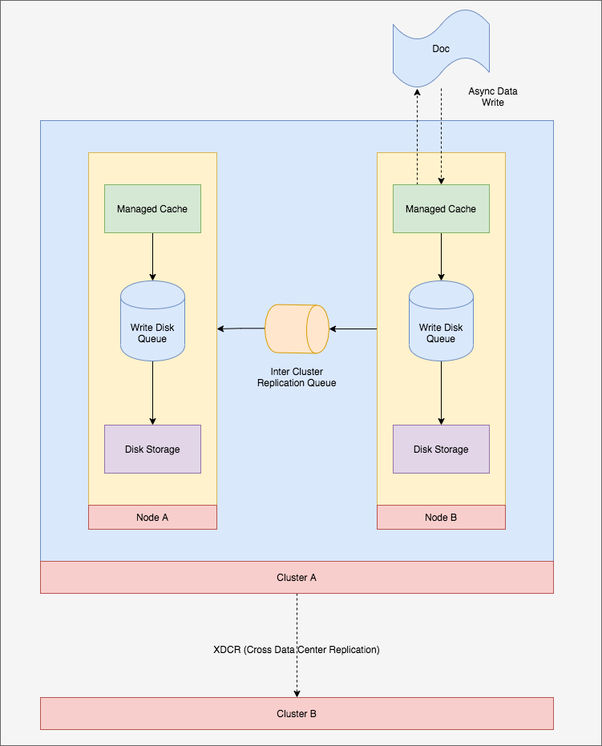
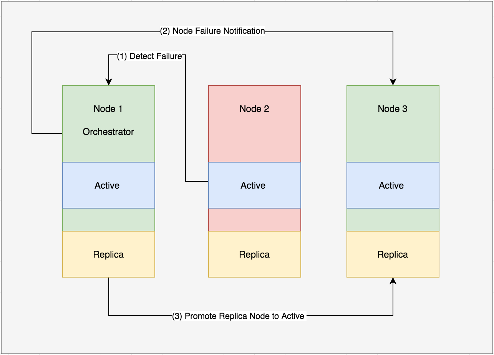

# Architecture of CouchBase 

## Introduction

- It is an open source, NoSQL document oriented database.
- Most obvious choice for modern web application.
- Provide flexible data model, is performant, is scalable and suitable choice for use case that shift traditional relational database in JSON document.  
- CouchBase is the combination of Memcached and CouchDB.

## Architecture

### Internals

- CouchBase is build on real shared-nothing architecture. That, means there is not point of contention, and every node is self sufficient and independent.
- With reference to the distributed technology, no node shared either memory or storage with any other node.
- Documents get stored in two formats: JSON or Binary.
- The documents get stored in Bucket. Every node has replicated Bucket.
- Under the hood these buckets are partitioned into <i>vBuckets</i>. These <i>vBuckets</i> are actually data partitioned.
- Every cluster maintains a cluster map that maps partition to the server.
- Every server has replication factor of 3 for every bucket.
- Every server maintains subset of active and replica vBuckets.

### How resiliency works ?

- As soon as the document gets index in CouchBase, it starts replicating.
- If node in the server goes down, replica partition become active one to promote continuous service.
- Only one copy of data remain active in case of zero or more replicas.

### CouchBase data flow

- The operation on database is asynchronous.
- That means when document gets update, CouchBase does not update it immediately on the disk. But it has to go through a process.
- As soon as the client connects to the server, and asynchronously writes the document in the managed cache. It immediately get back the response and not blocked for the data flow process to be completed.
- The client can be configured to wait as well.
- The document then pushed into inter-cluster replication queue, so the document can be replicated across the whole cluster.
- After that, the document is pushed into disk-write-queue to be persisted in the related disk.
- If there are multiple clusters deployed, then the XDCR (Cross Data Center Replication) feature propagate the same changes to other cluster as well.

         

### Read Operation

- Every document in CouchBase can be queried using document ID.
- There is a 2nd level index called design document, created within the bucket.  A bucket can hold multiple type of document, which also contains multiple views.
- A view is the function that index document in bucket in user-defined way. 
- The function is basically a map-reduce function that maps the document across key/value pair in the whole cluster. Which is then stored in the index for further retrieval.

    
    function(doc, meta) {
        if(doc.id){
            emit(doc, null)
        }
    }
    

### CouchBase failure

#### Case-I: When a node in cluster fails
- When a node in CouchBase cluster fails, the orchestrator node gets the failure notification.
- Orchestrator locate the replica node and promote them to become active node.

#### Case-II: When orchestrator fails
- All the nodes in the cluster detect the orchestrator failure by heartbeat watchdog, which is the cluster component that runs on all the nodes of the cluster.
- The nodes of the cluster use leader election algorithm and choose one of the existing node to become orchestrator.

         

## CouchBase Vs MongoDB

- The key important feature for me to choose CouchBase over MongoDB is performance benchmark that reveal high latency is lower for high operations throughputs than it is in MongoDB.

| MongoDB | CouchBase |
|---------|-----------| 
| Performance suffer from master worker replication. | Master less, clustered and replicated distributed from day 1.|
| All MongoDB services shared the resources, so it is impossible to isolate workloads.| MDS (Multi Dimensional Scaling) that provide independent scaling and workload isolation. |
| Suggest different development patters for Single-Node and sharded environment, that changes the way application function. Also, force AppDev and Ops teams to know about the data. | The application behaviour remain unchanged, no matter if it is using Single Node or sharded configuration. |
| Performance suffer due to limited page cache. Thus require 3rd party tool like Redis etc. | Tightly managed and fully integrated cache for both data and indexes. |
| Rigid data and index partitioning require slow cross node scatter-gather method for some specific queries. | Use Global Indexes where index are partitioned independent of data and thus minimize latency. |
| MongoDB has unique query language that requires a learning curve. | CouchBase query extends ANSI-SQL and leverage traditional database skill for easy adoption. |
 

## Reference

-  Scalabe Big Data Architecture by Bahaaldine Azarmi.