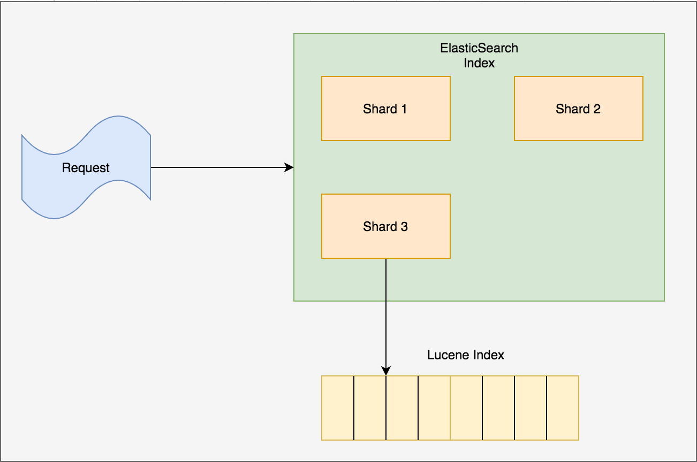
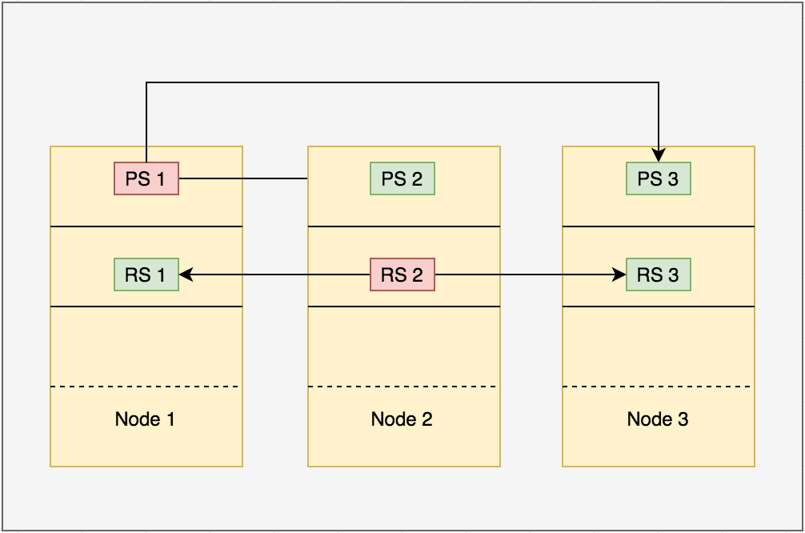

# ElasticSearch: Using NoSQL as cache

## Introduction
- Another NoSQL technology.
- It is a distributed datastore.
- Allow you to store, search and analyze data.
- It is an indexation of data on top of Apache Lucene, provide full-text search engine written in Java.

## Scaling
- Vertical: By increasing the resources of node. eg RAM, Disk space etc.
- Horizontal: Adding the node on the fly will increase High Availability and Resiliency.
- As ElasticSearch perform auto-replication of data, in the case of node failure other nodes are there to serve requests.


## Internal Architecture
- ElasticSearch has a schemaless engine.
- Documents are stored in JSON format.
- Partitioning is done in the form of Shards.
- A Shard is a Lucene index and the smallest unit of scale.
- <i>ElasticSearch index</i> is a logical namespaces that regroup the collection of shard.
- Whenever request comes to ElasticSearch it gets routed to appropriate shard.



### Shards
- Shards are of two types: Primary and Replica

#### Internal working of Primary Shard
- At the very start there is only 1 Primary Shard.
- As the time increases, read/write throughput also increase.
- 1 Primary Shard is not enough.
- Shards cannot scale on the fly, But nodes can.
- Requirement: Need bigger share, 2 more Primary Shards to re-index all the data.
- Solution: Adding new node will increase cluster capacity.
- As soon as the new nodes get added to the cluster, ElasticSearch copies shard over the network on new node.

#### Internal working of Replica Shard
- Replica shard only get created at failure.
- If Primary shard dies, then Replica shard becomes primary shard.



#### KeyNote
- Increasing replica will not increase performance
- Increasing nodes will increase performance.


### Nodes
#### Master Nodes
- Master Nodes hold no data, indexes or search requests.
- Perform cluster management.
- Ensure cluster stability.
- Recommended 3 Master Nodes (minimum), if 1 fails others will maintain redundancy.

#### Data Nodes
- Holds data, indexes and serve search requests.

#### Client Nodes
- Ensure load balancing.
- Sometimes perform part of the data node. For eg. scattering the requests over the nodes and gathering the responses.

## Monitoring of ElastiSearch
### Marvel
- Plugin for ElasticSearch monitoring.
- Throws metrics on Kibana.
- Type of Info: Node info, indexes, shards and CPU used.

## Search Request Example
- Search all documents under yahoo(example) index.

 ```
    curl -XGET localhost:9200/yahoo/_search -d '
     {
        "query": {
            "match_all": {}
        }
     }
    '
 ``` 
   
## Use Cases
### Using NoSQL as cache in SQL architecture.
- The search features in CouchBase are not really handy. That discourage using CouchBase alone.
- Handling map-reduce functions is not easy, if it is the case of simple aggregation.
- CouchBase ElasticSearch Plug-in: Replicates all data using XDCR (Cross Data Center Replication), from CouchBase to ElasticSearch.


### Why not ElasticSearch only ?
- ElasticSearch has ability to index entire object.
- ElasticSearch has ability to perform simple to complex search queries through search API.
- As per best practices the data should be stored in document database instead of data store       